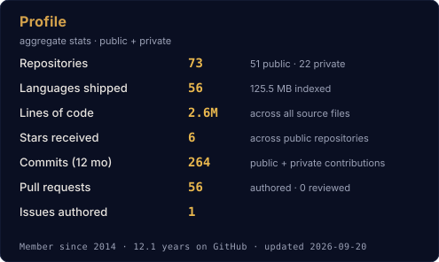
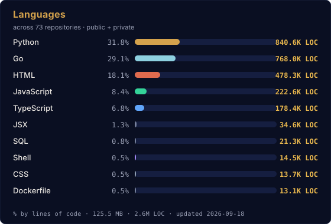

<div align="center">

<br>

# Dr. Devam R Shah

### CISO · DPO · AI Security & AI Governance Leader

*Translating AI risk and cyber risk into board-level business strategy.*

<br>

<a href="https://devamshah.github.io/"></a>
<a href="https://www.linkedin.com/in/thedevam/"></a>
<a href="mailto:devamshah91@gmail.com"></a>


<br><br>

<!-- merged-badge:start -->


<!-- merged-badge:end -->

</div>

---

## About

CISO & DPO leading **AI security, AI governance, privacy, and compliance** at **Locus — part of the Ingka Group (IKEA)** — a cloud-native logistics AI platform powering **1.5B+ deliveries across 30+ jurisdictions**.

A decade across **AI SaaS, healthcare, logistics, edtech, robotics, and defense** — building security programs from the ground up, leading crisis response, and translating AI risk into revenue and regulatory posture.

Recognized **CISO of the Year (2022 and 2023)**. Doctorate in AI and Cybersecurity.

---

## Current Mandate — Locus · Ingka / IKEA

```
Function         CISO + DPO (unified AI security + privacy)
Scale            30+ jurisdictions · 1.5B+ deliveries · cloud-native logistics AI
Frameworks       NIST AI RMF · ISO/IEC 42001 · EU AI Act · SOC 2 · GDPR · DPDPA
Team / Budget    Lean team of 5 · ~$1M annual
Outcomes         70,000+ vulnerabilities remediated · SOC 2 Type II delivered
                 96% reduction in late-stage vulnerabilities
                 AI governance stood up aligned to NIST AI RMF + ISO 42001
```

**Controls stack:** LLM guardrails (input/output) · prompt-injection defense · PII redaction before inference · model inventory with version pinning · AI-assisted SAST/SCA/secrets on AI-generated code · indirect-injection filters on RAG sources · phishing-resistant IAM (FIDO2) · CASB · multi-channel DLP · Zero Trust substrate.

---

## Career

| Role | Organization | Scope | Signature Outcome |
|---|---|---|---|
| **CISO & DPO** | **Locus · Ingka / IKEA** | 30+ jurisdictions · 1.5B+ deliveries | AI governance program · SOC 2 Type II · 96% fewer late-stage vulns |
| **CISO** | **Teachmint** | 35M+ student records · 33 countries · 600+ schools | First AI-enabled connected classroom secured · GDPR / COPPA / DPDPA |
| **CISO** | **Byju's Great Learning** | 100+ countries · 2K+ employees · 5K+ teachers | Company-wide Zero Trust · ISO certifications unlocked 50+ B2B deals |
| **CISO** | **Meditab** | 5,000+ person org in active crisis | IR + 24×7 SOC built from zero · HITRUST i1 · SOC 2 II · ISO 27001/27701 |
| **Security Architecture** | **TCS** | EKA supercomputer (Chandrayaan 2, Mangalyaan) | 200K+ EPS SOC · modernization across 1,000+ offices |

---

## Open-Source AI Security

Built in the open. Community-driven. Zero enterprise licensing.

<table>
<tr>
<td width="33%" valign="top">

### [Vedha](https://github.com/DevamShah/vedha)
**Autonomous AI pentester**
White-box, source-code-aware security testing for web applications and APIs. Plans, executes, and reports across **OWASP Top 10 for LLMs** — prompt injection chains, jailbreaks, indirect injection via RAG, data-extraction probes — plus the full web/API surface.

`v1.0.0` · public

</td>
<td width="33%" valign="top">

### Verida
**SAST / SCA false-positive reduction**
Five-layer AI triage pipeline that eliminates the noise that kills AppSec programs. Open-source. Transparent rulings. Audit-friendly.

*In development*

</td>
<td width="33%" valign="top">

### Nimantrika
**Safe outbound automation**
Human-mimicry by design. Always safe-mode. Full jitter. Never 24/7. Built on the principle that the account is load-bearing.

*In development*

</td>
</tr>
</table>

---

## Open-Source Contributions

Public pull requests to repositories I don't own — auto-refreshed daily.

<!-- contributions:start -->
**21 merged · 18 in review · 10 closed** across **31** external project(s).

### Projects with accepted contributions

- **[projectdiscovery/nuclei-templates](https://github.com/projectdiscovery/nuclei-templates)** (12.8K ⭐) — _Community curated list of templates for the nuclei engine to find security vulnerabilities._<br>&nbsp;&nbsp;✅ 6 merged · ⚪ 3 closed · merged diff **+154 / −66**
- **[Tencent/AI-Infra-Guard](https://github.com/Tencent/AI-Infra-Guard)** (4.4K ⭐) — _A full-stack AI Red Teaming platform securing AI ecosystems via OpenClaw Security Scan, Agent Scan, Skills Scan, MCP scan, AI Infra scan and LLM jailbreak evaluation._<br>&nbsp;&nbsp;✅ 2 merged · 🟡 1 in review · merged diff **+651 / −0**
- **[msoedov/agentic_security](https://github.com/msoedov/agentic_security)** (2.0K ⭐) — _Agentic LLM Vulnerability Scanner / AI red teaming kit 🧪_<br>&nbsp;&nbsp;✅ 2 merged · merged diff **+720 / −7**
- **[GRCEngClub/claude-grc-engineering](https://github.com/GRCEngClub/claude-grc-engineering)** (364 ⭐) — _Open-source GRC toolkit from the GRC Engineering Club. Claude Code plugins for evidence collection, SCF crosswalks, multi-framework gap reports, OSCAL workflows._<br>&nbsp;&nbsp;✅ 2 merged · ⚪ 1 closed · merged diff **+1,698 / −7**
- **[ReversecLabs/spikee](https://github.com/ReversecLabs/spikee)** (230 ⭐) — _Simple Prompt Injection Kit for Evaluation and Exploitation_<br>&nbsp;&nbsp;✅ 2 merged · 🟡 1 in review · merged diff **+199 / −2**
- **[redcanaryco/atomic-red-team](https://github.com/redcanaryco/atomic-red-team)** (12.3K ⭐) — _Small and highly portable detection tests based on MITRE's ATT&CK._<br>&nbsp;&nbsp;✅ 1 merged · 🟡 1 in review · merged diff **+111 / −0**
- **[NVIDIA/garak](https://github.com/NVIDIA/garak)** (8.7K ⭐) — _the LLM vulnerability scanner_<br>&nbsp;&nbsp;✅ 1 merged · ⚪ 1 closed · merged diff **+107 / −0**
- **[intelowlproject/IntelOwl](https://github.com/intelowlproject/IntelOwl)** (4.6K ⭐) — _IntelOwl: manage your Threat Intelligence at scale_<br>&nbsp;&nbsp;✅ 1 merged · merged diff **+376 / −0**
- **[vulnerability-lookup/vulnerability-lookup](https://github.com/vulnerability-lookup/vulnerability-lookup)** (555 ⭐) — _Vulnerability-Lookup facilitates quick correlation of vulnerabilities from various sources, independent of vulnerability IDs, and streamlines the management of Coordinated Vulnerability Disclosure (CVD)._<br>&nbsp;&nbsp;✅ 1 merged · merged diff **+50 / −0**
- **[sublime-security/sublime-rules](https://github.com/sublime-security/sublime-rules)** (368 ⭐) — _Sublime rules for email attack detection, prevention, and threat hunting._<br>&nbsp;&nbsp;✅ 1 merged · merged diff **+1 / −1**
- **[Yamato-Security/hayabusa-rules](https://github.com/Yamato-Security/hayabusa-rules)** (222 ⭐) — _Curated Windows event log Sigma rules used in Hayabusa and Velociraptor._<br>&nbsp;&nbsp;✅ 1 merged · merged diff **+407 / −0**
- **[kubescape/regolibrary](https://github.com/kubescape/regolibrary)** (131 ⭐) — _The regolibrary package contains the controls Kubescape uses for detecting misconfigurations in Kubernetes manifests._<br>&nbsp;&nbsp;✅ 1 merged · merged diff **+96 / −3**
- **[KeygraphHQ/shannon](https://github.com/KeygraphHQ/shannon)** (46.5K ⭐) — _Shannon is an AI pentester for web applications and APIs. It analyzes your source code, identifies attack vectors, and executes real exploits to prove vulnerabilities before they reach production._<br>&nbsp;&nbsp;🟡 1 in review
- **[projectdiscovery/nuclei](https://github.com/projectdiscovery/nuclei)** (30.3K ⭐) — _Nuclei is a fast, customizable vulnerability scanner powered by the global security community and built on a simple YAML-based DSL, enabling collaboration to tackle trending vulnerabilities on the internet. It helps you find vulnerabilities in your applications, APIs, networks, DNS, and cloud configurations._<br>&nbsp;&nbsp;🟡 1 in review
- **[gitleaks/gitleaks](https://github.com/gitleaks/gitleaks)** (28.5K ⭐) — _Find secrets with Gitleaks 🔑_<br>&nbsp;&nbsp;🟡 2 in review
- **[blacklanternsecurity/bbot](https://github.com/blacklanternsecurity/bbot)** (10.3K ⭐) — _The recursive internet scanner for hackers. 🧡_<br>&nbsp;&nbsp;🟡 1 in review
- **[PyCQA/bandit](https://github.com/PyCQA/bandit)** (8.2K ⭐) — _Bandit is a tool designed to find common security issues in Python code._<br>&nbsp;&nbsp;🟡 1 in review
- **[Pennyw0rth/NetExec](https://github.com/Pennyw0rth/NetExec)** (5.7K ⭐) — _The Network Execution Tool_<br>&nbsp;&nbsp;⚪ 1 closed
- **[ossf/scorecard](https://github.com/ossf/scorecard)** (5.6K ⭐) — _OpenSSF Scorecard - Security health metrics for Open Source_<br>&nbsp;&nbsp;⚪ 1 closed
- **[RhinoSecurityLabs/pacu](https://github.com/RhinoSecurityLabs/pacu)** (5.3K ⭐) — _The AWS exploitation framework, designed for testing the security of Amazon Web Services environments._<br>&nbsp;&nbsp;🟡 1 in review
- **[DataDog/stratus-red-team](https://github.com/DataDog/stratus-red-team)** (2.4K ⭐) — _:cloud: :zap: Granular, Actionable Adversary Emulation for the Cloud_<br>&nbsp;&nbsp;⚪ 1 closed
- **[confident-ai/deepteam](https://github.com/confident-ai/deepteam)** (2.3K ⭐) — _DeepTeam is a framework to red team LLMs and AI agents._<br>&nbsp;&nbsp;🟡 1 in review
- **[stacklok/toolhive](https://github.com/stacklok/toolhive)** (2.0K ⭐) — _ToolHive is an enterprise-grade platform for running and managing Model Context Protocol (MCP) servers._<br>&nbsp;&nbsp;⚪ 1 closed
- **[utkusen/promptmap](https://github.com/utkusen/promptmap)** (1.2K ⭐) — _a security scanner for custom LLM applications_<br>&nbsp;&nbsp;🟡 1 in review
- **[safedep/vet](https://github.com/safedep/vet)** (1.1K ⭐) — _Protect against malicious open source packages 🤖_<br>&nbsp;&nbsp;⚪ 1 closed
- **[trailofbits/fickling](https://github.com/trailofbits/fickling)** (655 ⭐) — _A Python pickling decompiler and static analyzer_<br>&nbsp;&nbsp;🟡 1 in review
- **[ossf/malicious-packages](https://github.com/ossf/malicious-packages)** (592 ⭐) — _A repository of reports of malicious packages identified in Open Source package repositories, consumable via the Open Source Vulnerability (OSV) format._<br>&nbsp;&nbsp;🟡 1 in review
- **[trailofbits/semgrep-rules](https://github.com/trailofbits/semgrep-rules)** (514 ⭐) — _Semgrep queries developed by Trail of Bits._<br>&nbsp;&nbsp;🟡 1 in review
- **[sigstore/model-transparency](https://github.com/sigstore/model-transparency)** (243 ⭐) — _Supply chain security for ML_<br>&nbsp;&nbsp;🟡 1 in review
- **[t0sche/cvss-bt](https://github.com/t0sche/cvss-bt)** (226 ⭐) — _Enriching the NVD CVSS scores to include Temporal & Threat Metrics_<br>&nbsp;&nbsp;🟡 1 in review
- **[falcosecurity/rules](https://github.com/falcosecurity/rules)** (183 ⭐) — _Falco rule repository_<br>&nbsp;&nbsp;🟡 1 in review

<details>
<summary><b>All pull requests</b></summary>

| Repository | ⭐ | Pull Request | Diff | Status |
|---|---:|---|---:|---|
| [projectdiscovery/nuclei-templates](https://github.com/projectdiscovery/nuclei-templates) | 12.8K | [#16053](https://github.com/projectdiscovery/nuclei-templates/pull/16053) fix(tomcat-default-login): order payloads to dodge LockOutRealm (FN) | +51 / −55 | ✅ Merged |
| [projectdiscovery/nuclei-templates](https://github.com/projectdiscovery/nuclei-templates) | 12.8K | [#16055](https://github.com/projectdiscovery/nuclei-templates/pull/16055) add: LiteLLM proxy unauthenticated /model/info exposure | +51 / −0 | ✅ Merged |
| [projectdiscovery/nuclei-templates](https://github.com/projectdiscovery/nuclei-templates) | 12.8K | [#16385](https://github.com/projectdiscovery/nuclei-templates/pull/16385) dns: add internal IP address disclosure in DNS A records | +42 / −0 | ✅ Merged |
| [projectdiscovery/nuclei-templates](https://github.com/projectdiscovery/nuclei-templates) | 12.8K | [#16056](https://github.com/projectdiscovery/nuclei-templates/pull/16056) add: ChromaDB unauthenticated collections API exposure | +9 / −3 | ✅ Merged |
| [projectdiscovery/nuclei-templates](https://github.com/projectdiscovery/nuclei-templates) | 12.8K | [#16050](https://github.com/projectdiscovery/nuclei-templates/pull/16050) fix: drop clear-site-data matcher from http-missing-security-header… | +0 / −7 | ✅ Merged |
| [projectdiscovery/nuclei-templates](https://github.com/projectdiscovery/nuclei-templates) | 12.8K | [#16052](https://github.com/projectdiscovery/nuclei-templates/pull/16052) fix(CVE-2021-40438): support custom interactsh server hostnames (FN) | +1 / −1 | ✅ Merged |
| [redcanaryco/atomic-red-team](https://github.com/redcanaryco/atomic-red-team) | 12.3K | [#3370](https://github.com/redcanaryco/atomic-red-team/pull/3370) Add T1567.004 - Exfiltration Over Webhook (Discord/Slack/Teams) | +111 / −0 | ✅ Merged |
| [NVIDIA/garak](https://github.com/NVIDIA/garak) | 8.7K | [#1859](https://github.com/NVIDIA/garak/pull/1859) fix: catch OpenAI AuthenticationError before multiprocessing pickle | +107 / −0 | ✅ Merged |
| [intelowlproject/IntelOwl](https://github.com/intelowlproject/IntelOwl) | 4.6K | [#3802](https://github.com/intelowlproject/IntelOwl/pull/3802) Add CVE_Exploitability analyzer (CISA KEV + FIRST EPSS) for CVE obs… | +376 / −0 | ✅ Merged |
| [Tencent/AI-Infra-Guard](https://github.com/Tencent/AI-Infra-Guard) | 4.4K | [#427](https://github.com/Tencent/AI-Infra-Guard/pull/427) feat(eval): add agentic-tool-misuse evaluation dataset | +384 / −0 | ✅ Merged |
| [Tencent/AI-Infra-Guard](https://github.com/Tencent/AI-Infra-Guard) | 4.4K | [#424](https://github.com/Tencent/AI-Infra-Guard/pull/424) feat(data): add 6 llama.cpp CVE rules (RPC RCE + GGUF/tokenizer mem… | +267 / −0 | ✅ Merged |
| [msoedov/agentic_security](https://github.com/msoedov/agentic_security) | 2.0K | [#321](https://github.com/msoedov/agentic_security/pull/321) feat: config-pluggable refusal classifiers and leak detectors | +491 / −4 | ✅ Merged |
| [msoedov/agentic_security](https://github.com/msoedov/agentic_security) | 2.0K | [#320](https://github.com/msoedov/agentic_security/pull/320) fix: wildcard CORS + credentials spec violation, path-traversal gua… | +229 / −3 | ✅ Merged |
| [vulnerability-lookup/vulnerability-lookup](https://github.com/vulnerability-lookup/vulnerability-lookup) | 555 | [#431](https://github.com/vulnerability-lookup/vulnerability-lookup/pull/431) new: [perf] add pg_trgm GIN indexes for sighting source/vulnerabili… | +50 / −0 | ✅ Merged |
| [sublime-security/sublime-rules](https://github.com/sublime-security/sublime-rules) | 368 | [#4655](https://github.com/sublime-security/sublime-rules/pull/4655) fix: replace deprecated $alexa_1m with $tranco_1m in link_cuttly di… | +1 / −1 | ✅ Merged |
| [GRCEngClub/claude-grc-engineering](https://github.com/GRCEngClub/claude-grc-engineering) | 364 | [#72](https://github.com/GRCEngClub/claude-grc-engineering/pull/72) feat(frameworks): Reference-depth India DPDPA plugin (ind-dpdpa) | +1,425 / −0 | ✅ Merged |
| [GRCEngClub/claude-grc-engineering](https://github.com/GRCEngClub/claude-grc-engineering) | 364 | [#71](https://github.com/GRCEngClub/claude-grc-engineering/pull/71) ci(plugins): validate manifests against JSON Schema on every PR | +273 / −7 | ✅ Merged |
| [ReversecLabs/spikee](https://github.com/ReversecLabs/spikee) | 230 | [#109](https://github.com/ReversecLabs/spikee/pull/109) feat: add homoglyph encoding plugin (Unicode confusables) | +197 / −0 | ✅ Merged |
| [ReversecLabs/spikee](https://github.com/ReversecLabs/spikee) | 230 | [#111](https://github.com/ReversecLabs/spikee/pull/111) docs: fix GOAT citation and note workspace-only status in 02_builti… | +2 / −2 | ✅ Merged |
| [Yamato-Security/hayabusa-rules](https://github.com/Yamato-Security/hayabusa-rules) | 222 | [#1036](https://github.com/Yamato-Security/hayabusa-rules/pull/1036) ci: block merge when a rule id (UUID) is used by more than one rule… | +407 / −0 | ✅ Merged |
| [kubescape/regolibrary](https://github.com/kubescape/regolibrary) | 131 | [#753](https://github.com/kubescape/regolibrary/pull/753) feat(C-0021): cover AI/ML inference and MLOps interfaces in sensiti… | +96 / −3 | ✅ Merged |
| [KeygraphHQ/shannon](https://github.com/KeygraphHQ/shannon) | 46.5K | [#322](https://github.com/KeygraphHQ/shannon/pull/322) Security hardening, CLI bug fixes, and SARIF report output | +1,677 / −40 | 🟡 In review |
| [projectdiscovery/nuclei](https://github.com/projectdiscovery/nuclei) | 30.3K | [#7495](https://github.com/projectdiscovery/nuclei/pull/7495) feat(reporting): add CSV result exporter (-csv-export) | +294 / −0 | 🟡 In review |
| [gitleaks/gitleaks](https://github.com/gitleaks/gitleaks) | 28.5K | [#2177](https://github.com/gitleaks/gitleaks/pull/2177) feat(rules): add Pinecone and LangSmith API key detection rules | +89 / −0 | 🟡 In review |
| [gitleaks/gitleaks](https://github.com/gitleaks/gitleaks) | 28.5K | [#2178](https://github.com/gitleaks/gitleaks/pull/2178) feat(rules): add Anthropic OAuth refresh token rule (sk-ant-ort01-) | +36 / −0 | 🟡 In review |
| [redcanaryco/atomic-red-team](https://github.com/redcanaryco/atomic-red-team) | 12.3K | [#3359](https://github.com/redcanaryco/atomic-red-team/pull/3359) Add T1213.005 - Data from Information Repositories: Messaging Appli… | +187 / −0 | 🟡 In review |
| [blacklanternsecurity/bbot](https://github.com/blacklanternsecurity/bbot) | 10.3K | [#3235](https://github.com/blacklanternsecurity/bbot/pull/3235) excavate: add AIApplicationExtractor for LLM endpoints, SDKs, and l… | +202 / −0 | 🟡 In review |
| [PyCQA/bandit](https://github.com/PyCQA/bandit) | 8.2K | [#1441](https://github.com/PyCQA/bandit/pull/1441) fix(B614): suppress false positive on non-literal weights_only; add… | +44 / −0 | 🟡 In review |
| [RhinoSecurityLabs/pacu](https://github.com/RhinoSecurityLabs/pacu) | 5.3K | [#534](https://github.com/RhinoSecurityLabs/pacu/pull/534) fix(sns__enum): paginate list_topics and list_subscriptions_by_topi… | +247 / −7 | 🟡 In review |
| [Tencent/AI-Infra-Guard](https://github.com/Tencent/AI-Infra-Guard) | 4.4K | [#429](https://github.com/Tencent/AI-Infra-Guard/pull/429) feat(agent-scan): add memory/RAG poisoning detection skill | +177 / −0 | 🟡 In review |
| [confident-ai/deepteam](https://github.com/confident-ai/deepteam) | 2.3K | [#236](https://github.com/confident-ai/deepteam/pull/236) feat(attacks): add Caesar, Morse, hex, zero-width & homoglyph encod… | +859 / −1 | 🟡 In review |
| [utkusen/promptmap](https://github.com/utkusen/promptmap) | 1.2K | [#10](https://github.com/utkusen/promptmap/pull/10) feat(rules): add indirect_injection category (12 rules) | +240 / −3 | 🟡 In review |
| [trailofbits/fickling](https://github.com/trailofbits/fickling) | 655 | [#283](https://github.com/trailofbits/fickling/pull/283) Add recursive directory and glob scanning to the CLI for bulk pickl… | +330 / −1 | 🟡 In review |
| [ossf/malicious-packages](https://github.com/ossf/malicious-packages) | 592 | [#1329](https://github.com/ossf/malicious-packages/pull/1329) docs: add a consumer guide for using the reports | +235 / −0 | 🟡 In review |
| [trailofbits/semgrep-rules](https://github.com/trailofbits/semgrep-rules) | 514 | [#83](https://github.com/trailofbits/semgrep-rules/pull/83) python: add hf-trust-remote-code rule (HuggingFace trust_remote_cod… | +103 / −0 | 🟡 In review |
| [sigstore/model-transparency](https://github.com/sigstore/model-transparency) | 243 | [#642](https://github.com/sigstore/model-transparency/pull/642) feat: Add in-memory signing API returning the Sigstore bundle as bytes | +130 / −4 | 🟡 In review |
| [ReversecLabs/spikee](https://github.com/ReversecLabs/spikee) | 230 | [#110](https://github.com/ReversecLabs/spikee/pull/110) feat(judges): add secret_leak judge for credential/PII exfiltration… | +324 / −0 | 🟡 In review |
| [t0sche/cvss-bt](https://github.com/t0sche/cvss-bt) | 226 | [#46](https://github.com/t0sche/cvss-bt/pull/46) feat: add exploit_maturity_source column for auditable E-value prov… | +158 / −1 | 🟡 In review |
| [falcosecurity/rules](https://github.com/falcosecurity/rules) | 183 | [#373](https://github.com/falcosecurity/rules/pull/373) new(rules): detect GPU/accelerator cryptojacking and device access … | +81 / −0 | 🟡 In review |
| [projectdiscovery/nuclei-templates](https://github.com/projectdiscovery/nuclei-templates) | 12.8K | [#16054](https://github.com/projectdiscovery/nuclei-templates/pull/16054) add: Langflow unauthenticated flow API exposure detection | +80 / −0 | ⚪ Closed |
| [projectdiscovery/nuclei-templates](https://github.com/projectdiscovery/nuclei-templates) | 12.8K | [#16386](https://github.com/projectdiscovery/nuclei-templates/pull/16386) add: Qdrant vector database - unauthenticated collections exposure | +48 / −0 | ⚪ Closed |
| [projectdiscovery/nuclei-templates](https://github.com/projectdiscovery/nuclei-templates) | 12.8K | [#16051](https://github.com/projectdiscovery/nuclei-templates/pull/16051) fix(CVE-2025-58360): switch GeoServer XXE detection to OAST (FN on … | +15 / −8 | ⚪ Closed |
| [NVIDIA/garak](https://github.com/NVIDIA/garak) | 8.7K | [#1858](https://github.com/NVIDIA/garak/pull/1858) probes: add many-shot jailbreaking probe | +195 / −0 | ⚪ Closed |
| [Pennyw0rth/NetExec](https://github.com/Pennyw0rth/NetExec) | 5.7K | [#1289](https://github.com/Pennyw0rth/NetExec/pull/1289) fix(mssql): print a clean error for --rid-brute without authentication | +3 / −0 | ⚪ Closed |
| [ossf/scorecard](https://github.com/ossf/scorecard) | 5.6K | [#5103](https://github.com/ossf/scorecard/pull/5103) checks/sast: detect Semgrep, Bandit, and gosec SAST workflows | +162 / −0 | ⚪ Closed |
| [DataDog/stratus-red-team](https://github.com/DataDog/stratus-red-team) | 2.4K | [#886](https://github.com/DataDog/stratus-red-team/pull/886) Add MITRE ATLAS as a first-class framework mapping (Cost Harvesting… | +27 / −1 | ⚪ Closed |
| [stacklok/toolhive](https://github.com/stacklok/toolhive) | 2.0K | [#5588](https://github.com/stacklok/toolhive/pull/5588) Add CORS support to the transparent MCP proxy | +665 / −4 | ⚪ Closed |
| [safedep/vet](https://github.com/safedep/vet) | 1.1K | [#745](https://github.com/safedep/vet/pull/745) feat: add pre-commit hook for local dependency scanning (closes #443) | +116 / −0 | ⚪ Closed |
| [GRCEngClub/claude-grc-engineering](https://github.com/GRCEngClub/claude-grc-engineering) | 364 | [#70](https://github.com/GRCEngClub/claude-grc-engineering/pull/70) fix(plugins): use object form for plugin.json author field | +7 / −7 | ⚪ Closed |

</details>
<!-- contributions:end -->

---

## Expertise

**AI & LLM Security** — MLSecOps · Prompt injection defense · AI red teaming · Model supply chain · OWASP Top 10 for LLMs · RAG security · Agentic controls · Inference-time abuse monitoring

**AI Governance** — NIST AI RMF · ISO/IEC 42001 · EU AI Act high-risk categorization · AI DPIA · AI TPRM · Responsible AI · Human-in-the-loop design

**Privacy & Compliance** — GDPR · DPDPA · COPPA · HIPAA · HITRUST i1 · SOC 2 Type II · ISO 27001 · ISO 27701

**Security Programs** — Zero Trust architecture · Phishing-resistant IAM (FIDO2) · DevSecOps · AppSec automation · Incident response · Crisis leadership · Bug bounty & red teaming

**Boardroom** — Risk translation · Regulatory strategy · B2B revenue unlock via certifications · AI risk appetite framing

---

## Recognition

- **CISO of the Year** — 2022 and 2023
- **Doctorate** — AI and Cybersecurity (ISTM)
- **Postgraduate** — Symbiosis Centre for Information Technology
- Board advisor · fractional CISO · keynote speaker on AI security strategy and AI governance program design

---

<div align="center">

## Reach Out

Advisory · AI governance program design · AI compliance readiness (NIST AI RMF · ISO 42001 · EU AI Act) · board briefings

**[devamshah.github.io](https://devamshah.github.io/)** &nbsp;·&nbsp; **[LinkedIn](https://www.linkedin.com/in/thedevam/)** &nbsp;·&nbsp; **[devamshah91@gmail.com](mailto:devamshah91@gmail.com)**

<br>




<br><br>

<sub><i>Security programs built to ship — transparent, open-source, board-defensible.</i></sub>

</div>
